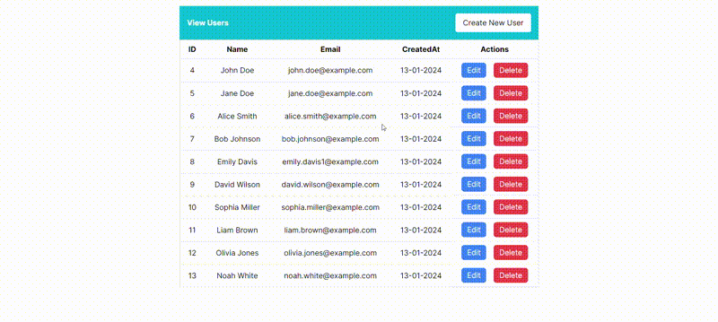

## Project Description

User Management System is a project that includes a backend developed in Golang and a frontend designed with Next.js. This system allows you to perform CRUD (Create, Read, Update, Delete) operations on user data.



## Installation

1. Backend repository: [Golang Backend](https://github.com/gokmenozkn/fill-labs-backend)
```bash
git clone https://github.com/gokmenozkn/fill-labs-backend.git
cd fill-labs-backend
go run main.go
```

2. Frontend repository: [fill-labs-frontend](https://github.com/gokmenozkn/fill-labs-frontend)
```bash
git clone https://github.com/gokmenozkn/fill-labs-frontend.git
cd fill-labs-frontend
npm install
npm run dev
```

## Usage

- After running the backend, start the frontend, and navigate to `http://localhost:3000` in your browser.
- Perform operations to create, update, and delete users.
